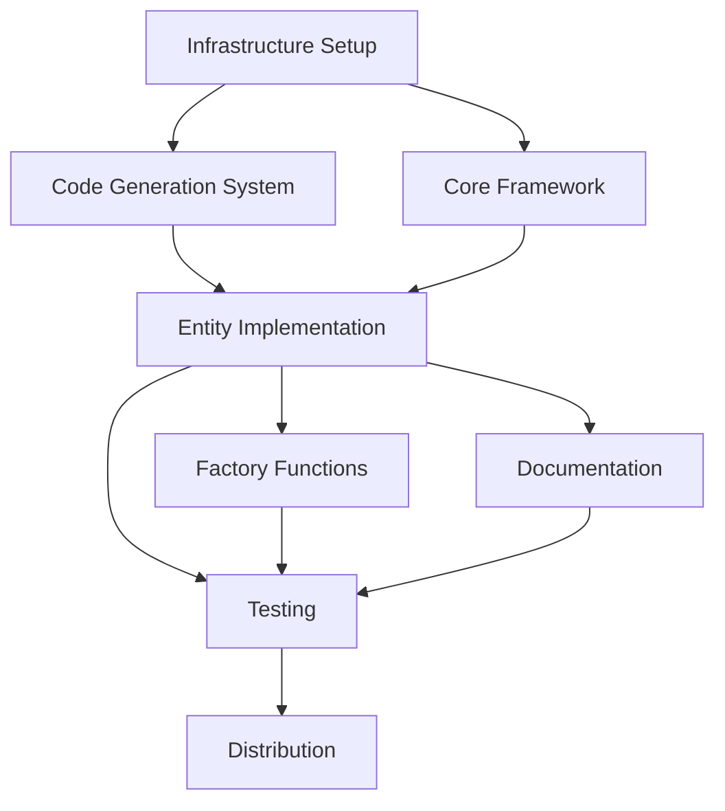

# Implementation Plan: Python SDK Generation

**Feature ID**: 003-python-sdk-generation
**Created**: 2025-10-31
**Status**: Planning
**Branch**: 003-python-sdk-generation

## Executive Summary

Implement a Python SDK for TIDAS/ILCD data management that mirrors the TypeScript SDK capabilities. The SDK will automatically generate Python classes from JSON schemas, provide type-safe entity operations, support configurable validation modes, and distribute via PyPI for easy installation.

**Key Deliverables**:
1. Code generation system that transforms JSON schemas into Pydantic models
2. 8 entity classes (Contact, Flow, Process, Source, FlowProperty, UnitGroup, LCIAMethod, LifeCycleModel)
3. Validation framework with strict/weak/ignore modes using Pydantic
4. Multi-language text field support with pythonic API
5. Comprehensive documentation and examples
6. PyPI package distribution with uv-based development workflow

## Technical Context

### Technology Stack

**Core Technologies**:
- **Python 3.8+**: Target runtime (development on 3.10+)
- **Pydantic v2.x**: Data validation and model generation
- **loguru**: Structured logging and observability
- **typing_extensions**: Backport typing features to Python 3.8
- **uv**: Package management and build tooling

**Code Generation**:
- **JSON Schema parsing**: Extract types, constraints, relationships from tidas-tools schemas
- **AST manipulation**: Generate Python code programmatically for maintainability
- **Template-based generation**: Alternative approach for simpler structures

**Testing & Quality**:
- **pytest**: Unit and integration testing
- **mypy**: Static type checking (strict mode)
- **pylint**: Code quality linting (target score >9.0)
- **ruff**: Fast Python linter and formatter

**Distribution**:
- **PyPI**: Package distribution as `tidas-sdk`
- **pyproject.toml**: Modern build configuration (PEP 621)
- **setuptools/hatchling**: Build backend

### Architecture Overview

```
tidas-sdk/
├── sdks/python/
│   ├── src/
│   │   ├── tidas_sdk/
│   │   │   ├── __init__.py
│   │   │   ├── core/
│   │   │   │   ├── base.py          # TidasEntity base class
│   │   │   │   ├── exceptions.py     # Exception types
│   │   │   │   ├── validation.py     # Validation framework
│   │   │   │   └── multilang.py      # Multi-language support
│   │   │   ├── models/               # Generated entity classes
│   │   │   │   ├── contact.py
│   │   │   │   ├── flow.py
│   │   │   │   ├── process.py
│   │   │   │   └── ...
│   │   │   ├── types/                # Generated Pydantic models
│   │   │   │   ├── tidas_contacts.py
│   │   │   │   ├── tidas_flows.py
│   │   │   │   └── ...
│   │   │   ├── factories.py          # create_* functions
│   │   │   └── config.py             # Global configuration
│   │   ├── scripts/
│   │   │   ├── generate_types.py     # Main generation script
│   │   │   └── schema_parser.py      # JSON schema parser
│   │   ├── tests/
│   │   │   ├── unit/
│   │   │   ├── integration/
│   │   │   └── test_data/
│   │   ├── examples/
│   │   │   ├── 01_basic_usage.py
│   │   │   ├── 02_batch_operations.py
│   │   │   ├── 03_validation_modes.py
│   │   │   └── 04_relationships.py
│   │   ├── docs/
│   │   │   ├── quickstart.md
│   │   │   ├── api_reference.md
│   │   │   └── migration_guide.md
│   │   └── pyproject.toml
```

### Code Generation Strategy

**Phase 1: Schema Analysis**
1. Scan `../tidas-tools/src/tidas_tools/tidas/schemas/` for JSON files
2. Parse each schema to extract:
   - Type definitions (objects, arrays, primitives)
   - Field constraints (string length, UUID format, enums)
   - Required vs optional fields
   - Multi-language field patterns
   - Cross-schema references (dependencies)
3. Build dependency graph for generation order

**Phase 2: Type Generation**
1. Generate Pydantic model for each schema
2. Apply Python naming conventions (snake_case)
3. Add type hints with Python 3.8 compatibility
4. Generate validators for constraints
5. Create docstrings from schema descriptions

**Phase 3: Entity Wrapper Generation**
1. Generate TidasContact, TidasFlow, etc. classes
2. Inherit from TidasEntity base class
3. Add convenience methods (validate, to_json, clone)
4. Integrate multi-language field wrappers

### Validation Architecture

**Three-Mode System**:

1. **Strict Mode** (default):
   - Raise ValidationError on any schema violation
   - Full Pydantic validation with all constraints
   - Used for: Data entry, API endpoints, strict data quality workflows

2. **Weak Mode**:
   - Collect violations as ValidationWarning objects
   - Never raise ValidationError
   - Allow processing to continue
   - Used for: ETL pipelines, data migration, iterative cleanup

3. **Ignore Mode**:
   - Skip validation entirely
   - Maximum performance
   - Used for: Bulk operations, trusted data sources, performance-critical paths

**Implementation**:
```python
class TidasEntity:
    def __init__(self, data, validation_config: ValidationConfig):
        self._validation_config = validation_config
        self._validation_warnings = []

    def validate(self):
        if self._validation_config.mode == "ignore":
            return

        result = self._pydantic_model.model_validate(self._data)

        if not result.is_valid():
            if self._validation_config.mode == "strict":
                raise ValidationError(result.errors)
            else:  # weak mode
                self._validation_warnings.extend(result.errors)
```

### Multi-language Text Implementation

**Design**:
- TIDAS multi-lang fields: `[{'@xml:lang': 'en', '#text': 'value'}]`
- Python wrapper: `MultiLangText` class with `set_text()`/`get_text()` methods

**API Design**:
```python
# Setting text
contact.contact_data_set.contact_information.data_set_information.name.set_text(
    "Dr. Jane Smith", lang="en"
)

# Getting text
name_en = contact.contact_data_set.contact_information.data_set_information.name.get_text("en")
name_any = contact.contact_data_set.contact_information.data_set_information.name.get_text()  # Returns first

# Raw access for advanced use
raw_array = contact.contact_data_set.contact_information.data_set_information.name.raw
```

### Error Handling Strategy

**Exception Hierarchy**:
```
TidasException (base)
├── ValidationError
│   └── Contains: field_path, expected, actual, constraint_type
├── SchemaGenerationError
└── ConfigurationError

Standard Exceptions:
├── JSONDecodeError (from json module)
└── FileNotFoundError (for schema access)
```

**Structured Error Data**:
```python
class ValidationError(TidasException):
    def __init__(self, field_path: str, expected: str, actual: Any):
        self.field_path = field_path
        self.expected = expected
        self.actual = actual
        self.message = f"Field '{field_path}' {expected}, got {actual!r}"
        super().__init__(self.message)
```

### Logging Strategy

**Loguru Configuration**:
- **INFO level**: Code generation progress, entity creation counts
- **WARNING level**: Validation warnings in weak mode
- **DEBUG level**: Field-level operations, detailed validation
- **ERROR level**: Exceptions, generation failures

**Example**:
```python
from loguru import logger

logger.info("Generating types from 18 schemas")
logger.debug(f"Processing schema: {schema_file}")
logger.warning(f"Weak validation: {warning.field_path} {warning.message}")
```

### Package Distribution

**Development Workflow** (using uv):
```bash
# Setup
cd sdks/python
uv venv
source .venv/bin/activate
uv pip install -e ".[dev]"

# Generate code
uv run scripts/generate_types.py

# Test
uv run pytest

# Build
uv build

# Publish
uv publish
```

**End User Installation**:
```bash
pip install tidas-sdk
# or
uv pip install tidas-sdk
```

## Constitution Check

### Alignment with Project Principles

Based on `.specify/memory/constitution.md` (if exists), evaluate:

1. **Code Quality Standards**: ✅
   - Mypy strict mode required
   - Pylint score >9.0 target
   - 100% docstring coverage for public API

2. **Testing Requirements**: ✅
   - Unit tests for all generated code
   - Integration tests for validation modes
   - Example code doubles as acceptance tests

3. **Documentation Standards**: ✅
   - Quick Start guide
   - API reference (generated from docstrings)
   - Migration guide from TypeScript

4. **Dependency Management**: ✅
   - Minimal runtime dependencies (Pydantic, loguru, typing_extensions)
   - uv for development consistency
   - Reproducible builds via committed generated code

## Phase 0: Research & Decisions

### Key Research Areas

1. **Pydantic v2 Best Practices**
   - Model validation patterns
   - Custom validators for TIDAS constraints
   - Performance optimization techniques

2. **JSON Schema to Pydantic Mapping**
   - Type conversion strategies
   - Constraint preservation
   - Nested object handling

3. **Python Code Generation Patterns**
   - AST manipulation vs templating
   - Maintainability considerations
   - Generated code formatting

4. **Multi-language Text Patterns**
   - Pythonic API design
   - Backward compatibility with raw access
   - Type hint strategies

5. **uv Package Manager Integration**
   - Workspace configuration
   - Script execution patterns
   - Build and publish workflows

See: `research.md` for detailed findings.

## Phase 1: Design Artifacts

### Data Model

See: `data-model.md` for complete entity definitions and relationships.

**Core Entities**:
1. **TidasEntity** (base class)
   - Fields: _data, _validation_config, _validation_warnings
   - Methods: validate(), to_json(), clone(), get_value()

2. **Contact, Flow, Process, Source, FlowProperty, UnitGroup, LCIAMethod, LifeCycleModel**
   - Each wraps corresponding Pydantic model
   - Provides entity-specific convenience methods

3. **MultiLangText**
   - Fields: items (list of lang/text pairs)
   - Methods: set_text(value, lang), get_text(lang)

### API Contracts

See: `contracts/` directory for detailed API specifications.

**Factory Functions** (in `factories.py`):
```python
def create_contact(data: Optional[dict] = None,
                   validation_config: Optional[ValidationConfig] = None) -> TidasContact
def create_contacts_batch(data_list: list[dict],
                          validation_config: Optional[ValidationConfig] = None) -> list[TidasContact]
# Similar for all 8 entity types
```

**Validation API**:
```python
class TidasEntity:
    def validate(self) -> None  # Raises ValidationError in strict mode
    def get_validation_warnings(self) -> list[ValidationWarning]
    def set_validation_mode(self, mode: Literal["strict", "weak", "ignore"])
```

**Configuration API**:
```python
def set_global_validation_mode(mode: Literal["strict", "weak", "ignore"])
def get_global_validation_mode() -> str
```

### Quick Start Guide

See: `quickstart.md` for complete getting started tutorial.

**30-Second Example**:
```python
from tidas_sdk import create_contact

# Create contact
contact = create_contact()

# Set multi-language name
contact.contact_data_set.contact_information.data_set_information.name.set_text(
    "Dr. Jane Smith", "en"
)

# Validate
contact.validate()  # Raises ValidationError if invalid

# Export
json_str = contact.to_json_string(indent=2)
```

## Phase 2: Implementation Tasks

### Task Breakdown

Will be generated in `tasks.md` by `/speckit.tasks` command.

**High-level Task Categories**:

1. **Infrastructure Setup** (3-5 tasks)
   - Initialize Python package structure
   - Configure uv and pyproject.toml
   - Setup testing framework

2. **Code Generation System** (8-12 tasks)
   - Implement JSON schema parser
   - Build dependency graph analyzer
   - Create Pydantic model generator
   - Create entity wrapper generator
   - Implement multi-language field generator

3. **Core Framework** (5-8 tasks)
   - Implement TidasEntity base class
   - Create exception hierarchy
   - Build validation framework
   - Implement MultiLangText class
   - Add logging integration

4. **Entity Implementation** (8 tasks, one per entity)
   - Generate and verify each entity type

5. **Factory Functions** (2-3 tasks)
   - Implement create_* functions
   - Implement batch creation functions

6. **Documentation** (4-6 tasks)
   - Write Quick Start guide
   - Generate API reference
   - Create migration guide
   - Write 4+ example scripts

7. **Testing** (5-8 tasks)
   - Unit tests for base classes
   - Integration tests for validation modes
   - Example code verification
   - Performance benchmarks

8. **Distribution** (2-3 tasks)
   - Configure PyPI publishing
   - Create release workflow
   - Verify installation on clean environments

**Estimated Total**: 40-55 implementation tasks

### Dependencies & Sequencing



**Critical Path**:
1. Infrastructure → Code Generation → Core Framework → Entity Implementation → Testing → Distribution

**Parallel Work Opportunities**:
- Documentation can start once API contracts are defined
- Testing can begin as soon as first entity is implemented
- Examples can be written alongside entity implementation

## Risks & Mitigations

### Technical Risks

1. **Pydantic Performance Overhead**
   - **Risk**: Validation may be too slow for bulk operations
   - **Mitigation**: Provide ignore mode; benchmark early; optimize hot paths
   - **Contingency**: Consider optional C extensions or alternative validation

2. **JSON Schema Complexity**
   - **Risk**: Some TIDAS schema patterns may not map cleanly to Pydantic
   - **Mitigation**: Research TypeScript SDK challenges; prototype complex schemas early
   - **Contingency**: Hand-written models for problematic schemas

3. **Multi-language API Usability**
   - **Risk**: Pythonic API may not match TypeScript SDK closely enough
   - **Mitigation**: Design review with stakeholders; prioritize ergonomics
   - **Contingency**: Provide both pythonic and TypeScript-like APIs

4. **Code Generation Maintenance**
   - **Risk**: Generated code may be difficult to debug or customize
   - **Mitigation**: Generate readable code; include comments; commit generated files
   - **Contingency**: Support manual overrides for specific entities

### Process Risks

1. **Schema Changes During Development**
   - **Risk**: tidas-tools schemas evolve breaking generation
   - **Mitigation**: Pin schema version; automated tests on schema changes
   - **Contingency**: Version generated code separately from schemas

2. **Documentation Drift**
   - **Risk**: Examples and docs become outdated
   - **Mitigation**: Run examples as tests; auto-generate API docs
   - **Contingency**: Regular documentation review cycles

## Success Metrics

### Acceptance Criteria (from spec)

All 10 acceptance criteria must pass:
1. ✅ Installation completes within 2 minutes
2. ✅ Code generation completes in <30 seconds
3. ✅ Entity creation in 5-10 lines of code
4. ✅ setText/getText work consistently
5. ✅ Validation modes switchable
6. ✅ 1000 entities created in <1 second (ignore mode)
7. ✅ Type hints enable autocomplete
8. ✅ Error messages include path, expected, actual
9. ✅ JSON round-trip preserves data
10. ✅ Example code executes without modification

### Development Milestones

**Milestone 1: Code Generation Working** (Week 2)
- All 18 schemas generate valid Python
- Pydantic models pass mypy strict
- Basic entity classes instantiable

**Milestone 2: Validation Framework Complete** (Week 3)
- All 3 modes implemented and tested
- Exception types defined
- Logging integrated

**Milestone 3: Feature Complete** (Week 4)
- All 8 entities working
- Factory functions implemented
- Examples written and tested

**Milestone 4: Production Ready** (Week 5)
- Documentation complete
- PyPI package published
- Installation verified on 3 platforms

## Next Steps

After this planning phase, proceed with:

1. **`/speckit.tasks`** - Generate detailed task breakdown in `tasks.md`
2. **`/speckit.implement`** - Execute implementation plan task by task
3. Regular testing and validation against acceptance criteria

---

**Plan Version**: 1.0
**Last Updated**: 2025-10-31
